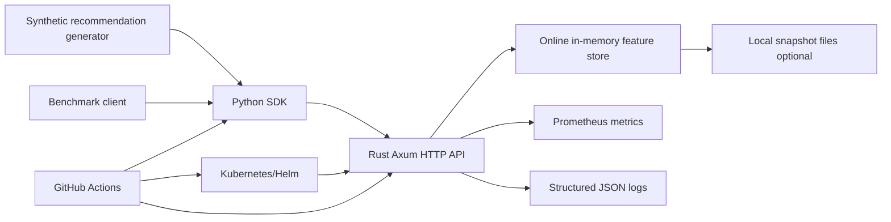
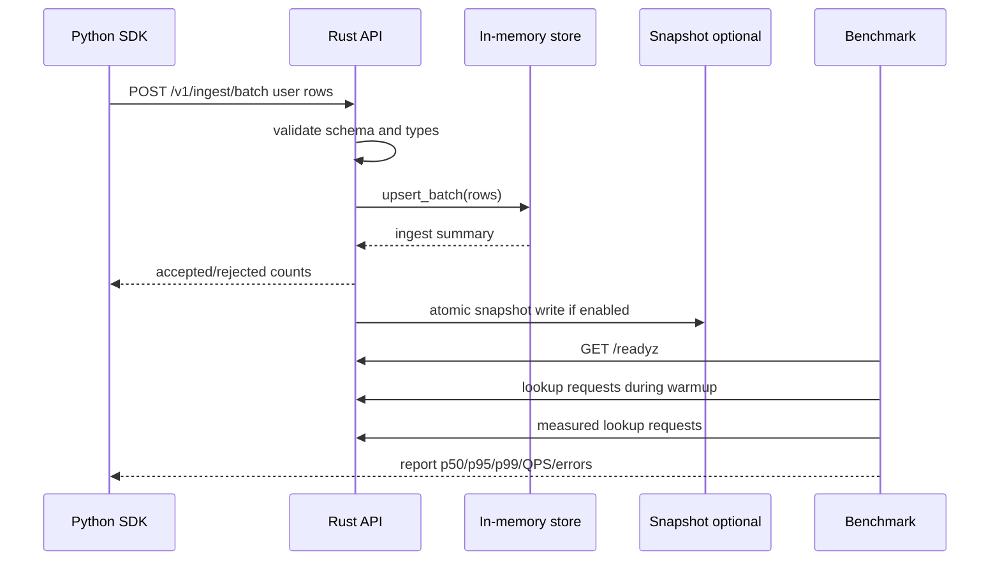

# Featherstore Architecture

Status: proposed MVP architecture for implementation
Owner: architect
Source requirements: `docs/product/PRD.md`

## 1. Problem statement

Featherstore is a minimal, public-ready online/offline feature store for a deterministic synthetic recommendation workload. The MVP must provide:

- A Rust serving plane with online low-latency feature reads, offline/bulk load, health/readiness, metrics, and structured logs.
- A Python SDK for data generation, ingestion, lookup, examples, and benchmark orchestration.
- Kubernetes/Helm deployment, CI, docs, GHCR release path, and reproducible benchmark reporting.
- Honest performance reporting: only claim `10k QPS p99 < 5 ms proven` when measured under documented conditions.

This architecture intentionally does not try to match full production feature stores. It designs one fast, inspectable vertical slice that can be built and verified quickly.

## 2. Architecture decisions

### Accepted direction

1. Rust HTTP server using Axum/Tokio.
2. Single-process, in-memory online store for MVP latency target.
3. Bulk/offline ingest through deterministic synthetic generator and JSON/NDJSON import path.
4. Optional local snapshot persistence to support restart reproducibility, not production durability.
5. Prometheus metrics at `/metrics`, structured JSON logs via `tracing`, health/readiness probes.
6. Python SDK uses HTTP APIs and owns synthetic dataset generation plus benchmark client.
7. Helm chart deploys one stateless-ish server pod by default, with optional PVC only if snapshot persistence is enabled.
8. Benchmark reports measured request QPS and entity lookup throughput separately to avoid misleading batch-size claims.

### Rejected alternatives

- Full database-backed feature store in MVP: rejected because the latency proof and public-ready path are easier to validate with an in-memory server; multiple storage backends are stretch scope.
- gRPC-only API: rejected for MVP because HTTP/JSON is easier for SDK, docs, curl examples, CI smoke, and Kubernetes probes. A future gRPC/protobuf API can be added behind the same store trait.
- Redis/RocksDB as required online store: rejected as a required dependency for MVP. They add deployment burden and benchmark ambiguity. RocksDB/Redis adapters can be future storage implementations.
- Advanced point-in-time correctness: rejected for MVP per PRD stretch scope.

### Core constraints

- Public repo must not contain secrets, private paths, or overclaimed benchmark output.
- `10k QPS p99 < 5 ms` is a target, not a default claim.
- Local kind/minikube benchmark results must be labeled local-fallback, not production proof.
- All benchmark reports must include command, environment, dataset size, concurrency, duration, errors, p50/p95/p99, throughput, and proof status.

## 3. Component overview



## 4. Service boundaries

### `featherstore-server` Rust binary

Responsibilities:

- Accept HTTP requests.
- Validate request payloads and schema references.
- Load feature rows through bulk ingest endpoints.
- Serve single and batch lookup requests from memory without disk access on the hot path.
- Export metrics and structured logs.
- Optionally save/load local snapshots.

Not responsible for:

- Generating synthetic data beyond small server-side test fixtures.
- Running benchmarks.
- Publishing Docker/GHCR artifacts.
- Full auth/multi-tenancy/quotas.

### `featherstore` Rust library crate

Responsibilities:

- Data model types shared by handlers, storage, tests, and benchmark fixtures.
- Store trait and in-memory implementation.
- Ingest validation.
- Snapshot serialization/deserialization.
- Metrics helpers.

### Python package `featherstore`

Responsibilities:

- SDK client for health, ingest, lookup, and metrics smoke.
- Deterministic synthetic recommendation dataset generator.
- Benchmark runner CLI wrapping HTTP calls and producing JSON/Markdown reports.
- Demo notebook helpers.

Not responsible for:

- Implementing low-latency serving logic.
- Faking benchmark results.

### Helm/Kubernetes deployment

Responsibilities:

- Deploy server container.
- Configure probes, service, resources, metrics annotations/ServiceMonitor.
- Support local kind/minikube install.
- Make image repository/tag configurable as `ghcr.io/<github-owner>/featherstore:<tag-or-sha>`.

## 5. Repository layout

Expected final repository root: `/Users/akhilkinnera/Documents/My Workspace/Test_Hermes/featherstore`

```text
featherstore/
  Cargo.toml
  Cargo.lock
  crates/
    featherstore/
      Cargo.toml
      src/
        lib.rs
        api.rs
        config.rs
        error.rs
        ingest.rs
        metrics.rs
        model.rs
        server.rs
        snapshot.rs
        store.rs
    featherstore-server/
      Cargo.toml
      src/main.rs
  python/
    pyproject.toml
    src/featherstore/
      __init__.py
      client.py
      models.py
      synthetic.py
      benchmark.py
      report.py
    tests/
      test_client_models.py
      test_synthetic.py
      test_benchmark_report.py
  benches/
    README.md
    synthetic_recommendation.md
  examples/
    quickstart.py
    demo_recommendation.ipynb
  deploy/
    helm/featherstore/
      Chart.yaml
      values.yaml
      templates/
        deployment.yaml
        service.yaml
        serviceaccount.yaml
        servicemonitor.yaml
        configmap.yaml
        _helpers.tpl
    grafana/
      featherstore-dashboard.json
  docs/
    product/PRD.md
    architecture/ARCHITECTURE.md
    architecture/IMPLEMENTATION_BLUEPRINT.md
    operations/
      benchmark.md
      observability.md
      kubernetes.md
      release.md
  .github/workflows/
    ci.yml
    docker.yml
    release.yml
  Dockerfile
  README.md
  LICENSE
  CONTRIBUTING.md
```

## 6. Data model

### Entities

The MVP synthetic recommendation workload uses three entity namespaces:

- `user`: stable user features such as age bucket, country id, embedding dimensions.
- `item`: stable item features such as category id, price bucket, embedding dimensions.
- `context`: request/context features such as hour bucket, device type, campaign id.

The store is generic enough to hold any entity namespace but docs and examples should focus on these three.

### Schemas

A feature schema defines the ordered names and types for an entity namespace.

Rust shape:

```rust
pub struct FeatureSchema {
    pub entity: EntityType,
    pub version: u32,
    pub features: Vec<FeatureDef>,
}

pub struct FeatureDef {
    pub name: FeatureName,
    pub dtype: FeatureDType,
    pub nullable: bool,
}

pub enum FeatureDType {
    Int64,
    Float64,
    Bool,
    String,
}
```

### Feature rows

Hot-path storage should use ordered values aligned to schema indices instead of per-row maps. API responses may expose maps for ergonomics.

```rust
pub struct FeatureRow {
    pub entity: EntityType,
    pub id: EntityId,
    pub values: Vec<FeatureValue>,
    pub event_ts_ms: Option<i64>,
}

pub enum FeatureValue {
    Int64(i64),
    Float64(f64),
    Bool(bool),
    String(Arc<str>),
    Null,
}
```

`EntityId` should support both numeric and string IDs at the API boundary. Internally, normalize to a stable key:

```rust
pub struct EntityKey {
    pub entity_code: u16,
    pub id_hash: u64,
}
```

For synthetic benchmark data, use numeric IDs and avoid hash collisions by encoding numeric IDs directly when possible.

### Missing data semantics

- Missing entity key returns an entry with `found: false`, `values: {}`, and no HTTP error.
- Malformed requests, unknown entity namespace, unknown feature name, or type mismatch return `400`.
- Internal failures return `500` and increment error metrics.
- Batch lookup can return partial misses with HTTP `200` if request itself is valid.

## 7. Storage strategy

### MVP online store

Use an in-memory store optimized for read latency:

- `ArcSwap<StoreSnapshot>` or `Arc<RwLock<StoreSnapshot>>` for the first implementation.
- `StoreSnapshot` contains immutable maps per entity namespace.
- Bulk ingest builds a new snapshot or namespace map off the hot path, then atomically swaps it in.
- Lookups take a read-only snapshot reference and do not wait on disk I/O.

Preferred first implementation:

```rust
pub trait FeatureStore: Send + Sync + 'static {
    fn schema(&self, entity: &EntityType) -> Option<FeatureSchema>;
    fn upsert_batch(&self, rows: Vec<FeatureRow>) -> Result<IngestSummary, StoreError>;
    fn lookup(&self, req: LookupRequest) -> Result<LookupResponse, StoreError>;
    fn stats(&self) -> StoreStats;
}
```

Implementation options:

- Start with `parking_lot::RwLock<HashMap<EntityKey, Arc<FeatureRow>>>` if fastest to implement.
- Move to `arc-swap` immutable snapshots if write contention hurts p99 during benchmark.
- Avoid disk, logging, allocation-heavy transforms, and schema recomputation in the lookup hot path.

### Offline/load path

Offline in MVP means deterministic batch generation and load into online serving state, not full historical feature computation.

Supported load mechanisms:

1. Python SDK posts batches to `/v1/ingest/batch`.
2. Server optionally loads a local NDJSON or snapshot file at startup if configured.
3. CI and examples use deterministic generator parameters so QA can reproduce data.

### Snapshot persistence

Optional MVP snapshot support:

- Config: `FEATHERSTORE_SNAPSHOT_PATH=/data/featherstore.snapshot`.
- Startup: if file exists and `load_snapshot_on_start=true`, load it before readiness.
- Ingest: if `persist_snapshot=true`, write temp file then atomic rename after successful batch/snapshot update.
- Format: `bincode` or MessagePack for speed and simplicity; include format version and checksum.

Snapshot persistence is not a substitute for production durability. Docs must label it as local reproducibility support.

## 8. HTTP API contract

Base path: no prefix for probes/metrics, `/v1` for product APIs.

### Health/readiness

`GET /healthz`

Response `200`:

```json
{"status":"ok"}
```

`GET /readyz`

Response `200` when server has initialized store and optional startup load is complete:

```json
{"status":"ready","schemas":3,"rows":120000}
```

Response `503` if startup load failed or is still in progress.

### Metrics

`GET /metrics`

Prometheus text exposition. Must include request count, request latency histogram, error count, ingest count, row count, and process/runtime metrics where available.

### Batch ingest

`POST /v1/ingest/batch`

Request:

```json
{
  "schema": {
    "entity": "user",
    "version": 1,
    "features": [
      {"name": "age_bucket", "dtype": "int64", "nullable": false},
      {"name": "country_id", "dtype": "int64", "nullable": false},
      {"name": "u_emb_0", "dtype": "float64", "nullable": false}
    ]
  },
  "rows": [
    {"id": "42", "values": {"age_bucket": 3, "country_id": 840, "u_emb_0": 0.123}, "event_ts_ms": 1778520000000}
  ],
  "mode": "upsert"
}
```

Response `200`:

```json
{
  "entity": "user",
  "accepted_rows": 1,
  "rejected_rows": 0,
  "total_rows": 1,
  "schema_version": 1
}
```

Validation:

- `mode` supports `upsert` for MVP. `replace_entity` is optional if easy.
- Reject unknown dtypes, missing non-null values, duplicate feature definitions, and row values not present in schema.
- Enforce configurable request body limit to avoid OOM.

### Lookup

`POST /v1/features/lookup`

Request:

```json
{
  "requests": [
    {"entity": "user", "id": "42", "features": ["age_bucket", "country_id"]},
    {"entity": "item", "id": "99", "features": null}
  ],
  "include_missing": true
}
```

Response `200`:

```json
{
  "rows": [
    {"entity": "user", "id": "42", "found": true, "values": {"age_bucket": 3, "country_id": 840}},
    {"entity": "item", "id": "99", "found": false, "values": {}}
  ],
  "elapsed_us": 412
}
```

Performance notes:

- `features: null` means return all features for that entity.
- The benchmark should include a fixed feature subset and all-features modes as separate scenarios.
- `elapsed_us` is server-observed handler elapsed time, not client latency proof.

### Fast single-row endpoint

`GET /v1/features/{entity}/{id}`

Query:

- `features=age_bucket,country_id` optional.

Response shape equals one lookup row:

```json
{"entity":"user","id":"42","found":true,"values":{"age_bucket":3,"country_id":840}}
```

This endpoint exists for curl demos and request-QPS benchmark scenarios because it avoids parsing a POST body. Do not use it to hide benchmark scenario details; reports must state endpoint and payload.

### Synthetic load helper endpoint (optional)

`POST /v1/admin/load-synthetic`

Optional and disabled by default unless `FEATHERSTORE_ENABLE_ADMIN=true`. Prefer Python SDK generation for reproducibility. If implemented, it must not be used to make undocumented benchmark datasets.

## 9. Python SDK API

Package import name: `featherstore`.

### Client

```python
from featherstore import FeatherstoreClient

client = FeatherstoreClient("http://localhost:8080", timeout=5.0)
client.health()
client.ready()
client.ingest_batch(schema, rows, mode="upsert")
rows = client.lookup([
    {"entity": "user", "id": "42", "features": ["age_bucket", "country_id"]},
])
row = client.get_features("user", "42", features=["age_bucket"])
```

Required class surface:

```python
class FeatherstoreClient:
    def __init__(self, base_url: str = "http://localhost:8080", timeout: float = 5.0): ...
    def health(self) -> dict: ...
    def ready(self) -> dict: ...
    def ingest_batch(self, schema: FeatureSchema, rows: list[FeatureRow], mode: str = "upsert") -> IngestSummary: ...
    def lookup(self, requests: list[LookupRequest], include_missing: bool = True) -> LookupResponse: ...
    def get_features(self, entity: str, entity_id: str, features: list[str] | None = None) -> LookupRow: ...
```

### Typed models

Use dataclasses or Pydantic if dependency cost is acceptable. Prefer dataclasses for minimal dependency footprint.

```python
@dataclass(frozen=True)
class FeatureDef:
    name: str
    dtype: Literal["int64", "float64", "bool", "string"]
    nullable: bool = False

@dataclass(frozen=True)
class FeatureSchema:
    entity: str
    version: int
    features: list[FeatureDef]

@dataclass(frozen=True)
class FeatureRow:
    id: str
    values: dict[str, int | float | bool | str | None]
    event_ts_ms: int | None = None
```

### Synthetic generator

```python
def generate_recommendation_dataset(
    users: int = 100_000,
    items: int = 100_000,
    contexts: int = 24,
    embedding_dims: int = 8,
    seed: int = 13,
) -> SyntheticDataset: ...
```

`SyntheticDataset` should expose schemas and iterable batches:

```python
@dataclass
class SyntheticDataset:
    user_schema: FeatureSchema
    item_schema: FeatureSchema
    context_schema: FeatureSchema
    def iter_user_batches(self, batch_size: int = 10_000) -> Iterator[list[FeatureRow]]: ...
    def iter_item_batches(self, batch_size: int = 10_000) -> Iterator[list[FeatureRow]]: ...
    def iter_context_batches(self, batch_size: int = 24) -> Iterator[list[FeatureRow]]: ...
```

### CLI commands

Expose with `python -m featherstore...` or console scripts:

```text
featherstore-load-synthetic --server http://localhost:8080 --users 100000 --items 100000 --embedding-dims 8 --seed 13
featherstore-benchmark --server http://localhost:8080 --duration 30 --warmup 5 --concurrency 128 --target-qps 10000 --endpoint lookup --output benchmark-report.json
```

## 10. Offline-to-online flow

1. Python generator creates deterministic schemas and rows for users/items/context.
2. SDK posts rows in bounded batches to `/v1/ingest/batch`.
3. Server validates schema and rows.
4. Store upserts rows into memory.
5. Optional snapshot writes after load for restart reproducibility.
6. Benchmark waits for `/readyz`, optionally checks row counts, warms up, then measures lookup latency.
7. Benchmark writes JSON report and optional Markdown summary.



## 11. Observability

### Metrics names

Required Prometheus metrics:

- `featherstore_http_requests_total{method,path,status}` counter.
- `featherstore_http_request_duration_seconds_bucket{method,path,status}` histogram.
- `featherstore_lookup_requests_total{entity,status}` counter.
- `featherstore_lookup_rows_total{entity,found}` counter.
- `featherstore_ingest_rows_total{entity,status}` counter.
- `featherstore_store_rows{entity}` gauge.
- `featherstore_store_schemas` gauge.
- `featherstore_errors_total{kind}` counter.

Recommended histogram buckets for low latency:

```text
0.00025, 0.0005, 0.001, 0.0025, 0.005, 0.0075, 0.01, 0.025, 0.05, 0.1, 0.25, 0.5, 1.0
```

### Logs

Use `tracing` with JSON formatting in container/Kubernetes mode.

Each request log should include:

- `request_id`
- `method`
- `path`
- `status`
- `elapsed_us`
- `error_kind` when applicable

Do not log feature payload values by default. Payload logs risk leaking user data in future non-synthetic use.

### Dashboard panels

Grafana dashboard should include:

- Request rate by path/status.
- p50/p95/p99 from histogram where available.
- Error rate.
- Store row counts by entity.
- Ingest rows/sec.
- Process CPU/memory if exporter/runtime metrics are available.

## 12. Kubernetes and Helm architecture

Chart name: `featherstore`.

Minimum values:

```yaml
image:
  repository: ghcr.io/OWNER/featherstore
  tag: latest
  pullPolicy: IfNotPresent

server:
  port: 8080
  logFormat: json
  snapshot:
    enabled: false
    mountPath: /data

service:
  type: ClusterIP
  port: 8080

resources:
  requests:
    cpu: 500m
    memory: 512Mi
  limits:
    cpu: "2"
    memory: 2Gi

metrics:
  enabled: true
  serviceMonitor:
    enabled: false
```

Deployment requirements:

- `readinessProbe`: `GET /readyz`.
- `livenessProbe`: `GET /healthz`.
- Named port `http`.
- Prometheus annotations if ServiceMonitor is disabled.
- Configurable env vars for bind address, log level, snapshot settings, request body limit.

Performance caveat:

- Default Kubernetes resources are for functional validation, not 10k QPS proof.
- Benchmark proof should record CPU/memory limits and node type.
- kind/minikube results must be labeled as local-fallback.

## 13. CI/CD and release design

### CI workflow gates

One `ci.yml` can start, split later if slow:

- Rust format: `cargo fmt --check`.
- Rust lint: `cargo clippy --workspace --all-targets -- -D warnings`.
- Rust tests: `cargo test --workspace`.
- Python install: `python -m pip install -e ./python[dev]`.
- Python tests: `pytest python/tests`.
- Docs build: docs-owned tool command, initially `mkdocs build` if MkDocs is selected.
- Docker build: `docker build -t featherstore:ci .` where Docker is available.
- Helm lint/template: `helm lint deploy/helm/featherstore` and `helm template featherstore deploy/helm/featherstore`.
- Benchmark smoke: start local server, load tiny dataset, run short benchmark with low target. This is not the proof benchmark.

### Docker image

Single multi-stage Dockerfile:

1. Rust builder stage.
2. Runtime distroless/debian-slim/alpine stage depending on TLS/runtime needs.
3. Non-root user.
4. Expose `8080`.
5. Default command runs `featherstore-server`.

### GHCR release

Image convention:

```text
ghcr.io/<github-owner>/featherstore:<tag-or-sha>
```

Release workflow:

- On push to main: build and optionally push SHA tag if permissions available.
- On semver tag: build and push tag plus `latest` only if desired.
- If credentials/permissions are missing, DevOps must block with exact non-secret reason and leave local build/push commands.

## 14. Performance strategy for 10k QPS p99 < 5 ms

### What can realistically reach the target

The target is feasible only if the measured path avoids disk, avoids write contention, minimizes allocations, and runs on adequate CPU/network. The architecture supports this by:

- Keeping lookup hot path memory-only.
- Using compact internal row representation aligned to schema.
- Avoiding payload logging.
- Providing a fast GET endpoint for single-row request-QPS measurement.
- Supporting batch lookup but reporting request QPS and entity lookup throughput separately.
- Using Rust/Tokio/Axum and release builds.
- Configuring bounded request size and simple handlers.

### Benchmark scenarios

Benchmark report must identify one of these scenarios:

1. `single_get_request_qps`: `GET /v1/features/{entity}/{id}` with a fixed small feature subset. This is the primary scenario for proving 10k HTTP request QPS p99 < 5 ms.
2. `batch_post_request_qps`: `POST /v1/features/lookup` with `batch_size > 1`. Report both HTTP request QPS and entity lookup/sec. Do not claim 10k request QPS if only entity lookup/sec crosses 10k.
3. `recommendation_triple_lookup`: one request looks up user, item, and context rows. Report as recommendation request QPS.
4. `sdk_e2e`: Python SDK path. Useful for user experience, but Python client overhead may prevent the strict latency target.

### Measurement method

- Build server in release mode or use release Docker image.
- Load deterministic dataset, e.g. `100_000 users`, `100_000 items`, `24 contexts`, `8 embedding_dims`, `seed=13`.
- Warm up for at least 5 seconds.
- Measure for at least 30 seconds for proof runs; shorter CI smoke is not proof.
- Use fixed concurrency and target QPS. Record both.
- Record machine: OS, CPU model/count where available, memory, local vs Docker vs Kubernetes, resource limits.
- Record server config and git SHA/image tag.
- Treat non-2xx responses or client timeouts as errors.
- Proof requires sustained measured throughput >= 10,000 request QPS and measured p99 < 5 ms with acceptable error rate, preferably 0 and at minimum explicitly reported.

### Expected bottlenecks and mitigations

- JSON serialization: use fixed small feature subset for strict benchmark; consider compact response option in future.
- Python client overhead: use async client with `httpx.AsyncClient`, but do not expect Python SDK path to prove the target by itself.
- Lock contention during ingest: do not ingest during lookup proof; if needed, use snapshot swap.
- Kubernetes resource throttling: set CPU limits high enough or remove limits for benchmark chart values; record exact values.
- Local Mac/Docker networking: may distort p99; report environment honestly.

## 15. Security and public release notes

MVP security posture:

- No authentication in MVP. Document server as suitable for trusted local/internal networks only.
- Do not expose public Internet without adding auth, TLS termination, and rate limiting.
- Do not log feature payloads by default.
- Run container as non-root.
- Enforce request body size limits.
- Include dependency scans if convenient, but do not block MVP on advanced SLSA/SBOM unless later assigned.
- No secrets in repo, notebooks, docs, CI logs, Helm values, or Kanban comments.
- GHCR tokens must come from GitHub Actions permissions or operator environment; never commit them.

Release notes should include:

- Maturity: MVP/experimental.
- Supported workload: deterministic synthetic recommendation workload.
- Unsupported: production durability, auth, multi-tenancy, advanced point-in-time joins, multiple backends.
- Benchmark proof status: `proven` only after QA measurement, otherwise `not proven` with measured results.

## 16. Failure modes

- Ingest too large: return `413` or `400` with clear message; metric increments.
- Malformed payload: return `400`, no partial ingest.
- Missing entity key: return `found: false`, HTTP `200`.
- Unknown feature: return `400` for invalid request.
- Snapshot load failure: readiness `503`; log non-secret error.
- Snapshot write failure after successful memory ingest: return warning field if feasible, increment metric, and document that memory state is updated but persistence failed.
- Benchmark target not reached: benchmark exits successfully if measurement is valid, but report status is `not_proven`; exits non-zero only for invalid run or unreachable service.

## 17. Tests and evaluation requirements

Rust tests:

- Model serialization/deserialization.
- Ingest validation success/failure.
- Missing-key lookup semantics.
- Feature subset lookup.
- Metrics endpoint smoke.
- Health/readiness.
- Snapshot round trip if implemented.

Python tests:

- Client request serialization.
- Synthetic generator determinism.
- Dataset batch iteration counts.
- Benchmark percentile calculation/report schema.
- Integration smoke against local server where practical.

Deployment tests:

- Docker image builds and starts.
- Helm lint/template passes.
- kind/minikube install if available.

Benchmark validation:

- Report contains required fields.
- Invalid run flags too many errors, too-short duration, missing warmup, or unreachable target.
- Proof status logic cannot mark proven unless measured QPS and p99 thresholds are met.

## 18. Handoff plan

### Coder handoff

Implement repository scaffold, Rust server/library, Python SDK, tests, examples, benchmark client, Dockerfile, and CI-ready scripts according to `docs/architecture/IMPLEMENTATION_BLUEPRINT.md`.

### DevOps handoff

After coder completes buildable artifacts, implement/verify Helm, Docker build, GHCR workflow, metrics scraping, dashboard JSON, local kind/minikube deployment, and benchmark environment labels.

### Docs handoff

After coder completes behavior, write README/docs/demo notebook from actual commands and measured handoffs. Do not overclaim benchmark or deployment status.

### QA handoff

Run release gates, benchmark proof, and final report. Create remediation tasks for defects. Mark benchmark `not proven` unless thresholds are measured exactly.
